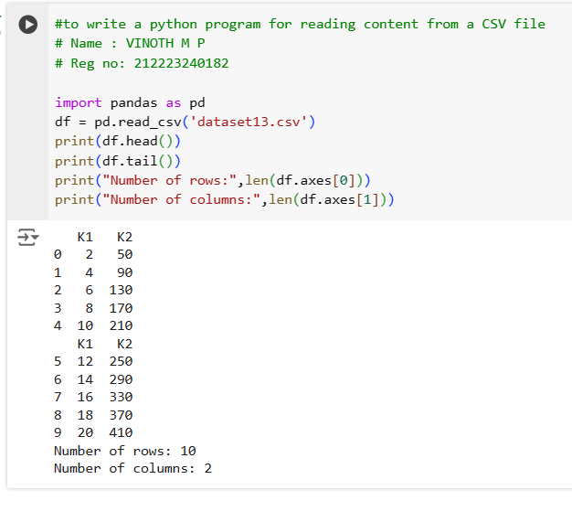

# Read-from-CSV

## AIM:
to write a python program for reading content from a CSV file

## ALGORITHM:
### Step 1:
import pandas as pd
### Step 2:
now read the csv file using pd.read_csv() and store it in a variable
### Step 3:
Now print the first 5 lines using head()
### Step 4:
and print the last 5 lines using tail()
### Step 5:
to find the number of rows and cols use len()

## PROGRAM:
```
#to write a python program for reading content from a CSV file
# Name : VINOTH M P
# Reg no: 212223240182

import pandas as pd
df = pd.read_csv('dataset13.csv')
print(df.head())
print(df.tail())
print("Number of rows:",len(df.axes[0]))
print("Number of columns:",len(df.axes[1]))

```
## OUTPUT:

## RESULT:
Thus the program to read the csv file is successfully created and eecuted